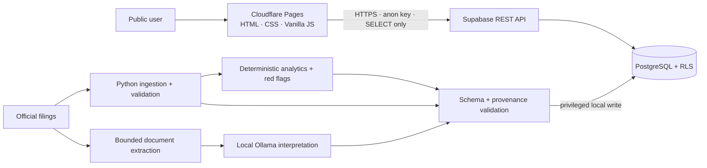

# Analyst OS

Analyst OS is a minimalist, source-backed, AI-assisted company-analysis workspace built as a flagship portfolio project. It demonstrates financial analytics, Python data engineering, PostgreSQL/Supabase, local AI with Ollama, secure frontend engineering, testing, and deployment discipline.

> **Positioning:** research and analysis tool only. Analyst OS does not provide investment advice, BUY/SELL signals, target prices, company investment rankings, or guaranteed returns.

## Current status

Repository engineering is implemented through **M6 — Security & Performance Hardening**. The project is **not yet production-ready** because two evidence-based release gates remain:

1. **M2 data population:** the [RIL/TCS P&L batch](data/m2/ril-tcs/batch1/README.md) and [balance-sheet/cash-flow batch](data/m2/ril-tcs/batch2/README.md) contain 764 observations and 376 validation-only candidates. The [offline planner](data/m2/ril-tcs/review/README.md), [database provenance safeguards](docs/PROVENANCE_SCHEMA.md) [read-only snapshot exporter](docs/TARGET_SNAPSHOT.md) and [controlled publisher](docs/CONTROLLED_PUBLISHING.md) are locally tested. A [56-fact P&L decision packet](data/m2/ril-tcs/review/PNL_DECISION_PACKET.md) now corroborates exact report rows and columns. Six conflicts, real reviews, remaining inputs, other-company history, a live publisher snapshot, concurrency verification and controlled loading remain pending. The [initial Supabase upgrade and access checks](docs/SUPABASE_VERIFICATION.md) passed on the live project. See [M2 next steps](docs/M2_NEXT_STEPS.md).
2. **M7 deployment verification:** the real Supabase and Cloudflare Pages projects still need runtime RLS, security-header, browser, accessibility, and deployment checks.

No synthetic production financial values are used merely to make the UI appear complete.

## V1 scope

- Company overview
- Historical financial trends
- Deterministic financial ratios
- Deterministic red-flag investigation signals
- Source-backed AI insights
- Small peer snapshot
- Primary-source references

The initial target universe is intentionally limited to five listed Indian companies: Reliance Industries, TCS, HDFC Bank, Tata Motors, and Larsen & Toubro. Coverage expands only after the end-to-end system is verified.

## Architecture principle

**Python calculates. AI interprets.**

The public application is static HTML/CSS/Vanilla JavaScript on Cloudflare Pages. It reads prepared public-display data from Supabase using browser-safe credentials and read-only RLS policies.

Privileged ingestion, normalization, deterministic analytics, document parsing, and Ollama execution happen locally/offline. Only validated outputs are eligible for controlled writes to Supabase.



Ollama is never required by the public application and must never be exposed to the public internet.

See [`docs/ARCHITECTURE.md`](docs/ARCHITECTURE.md) for the trust boundaries and full system design.

## Security model

Security is a release gate, not an afterthought. The repository includes controls for:

- RLS on every exposed Supabase table
- SELECT-only browser access
- no privileged Supabase credentials in frontend assets
- safe DOM rendering rather than untrusted HTML injection
- HTTPS-only external source links
- strict Cloudflare Pages CSP/security headers
- bounded document parsing
- prompt-injection-aware evidence handling
- loopback-only Ollama access
- strict AI output/evidence validation
- tracked-secret/config regression tests
- dependency vulnerability auditing

Exposed secrets, missing RLS, browser write access, a public Ollama endpoint, unsafe AI HTML, unvalidated documents, major XSS risks, critical vulnerable dependencies, or undocumented access policies block release.

## Zero-cost V1

Development and the intended initial portfolio deployment are designed for **₹0** using:

- Cloudflare Pages free tier
- Supabase free tier
- GitHub and GitHub Actions
- local Ollama
- public company disclosures
- open-source Python libraries

No paid VPS, custom domain, financial API, LLM API, or data subscription is required for V1.

## Repository layout

```text
web/                       Static frontend
python/                    Ingestion, analytics, AI, scripts, tests
supabase/migrations/       Database schema and RLS migrations
docs/                      Architecture, roadmap, security, sources, release docs
.github/workflows/         CI
```

Useful documentation:

- [`docs/ROADMAP.md`](docs/ROADMAP.md) — milestone status and acceptance criteria
- [`docs/ARCHITECTURE.md`](docs/ARCHITECTURE.md) — system design and trust boundaries
- [`docs/DATABASE.md`](docs/DATABASE.md) — database model
- [`docs/AI_PIPELINE.md`](docs/AI_PIPELINE.md) — local AI security/provenance model
- [`docs/DEMO.md`](docs/DEMO.md) — portfolio/interview walkthrough
- [`docs/DEPLOYMENT.md`](docs/DEPLOYMENT.md) — Supabase + Cloudflare Pages deployment runbook
- [`docs/RELEASE_CHECKLIST.md`](docs/RELEASE_CHECKLIST.md) — evidence-based M7 release gate
- [`SECURITY.md`](SECURITY.md) and [`docs/SECURITY.md`](docs/SECURITY.md) — security policy/design

## Local setup

```bash
python -m venv .venv
# Windows: .venv\Scripts\activate
# macOS/Linux: source .venv/bin/activate
python -m pip install --upgrade pip
pip install -e ".[dev]"
pytest
```

Copy `.env.example` to `.env` only for local development. Never commit `.env` or privileged credentials.

For the frontend, copy `web/js/config.example.js` to `web/js/config.js` and supply only browser-safe Supabase values. `config.js` is intentionally ignored by Git.

## CI quality gate

Pull requests are expected to pass:

```text
Ruff
pytest
browser JavaScript syntax validation
PostgreSQL migration/provenance tests (development-only PGlite)
npm audit
pip-audit
```

A milestone is not considered verified while its required gate is failing.

## Milestone status

| Milestone | Status |
|---|---|
| M0 — Foundation | Completed |
| M1 — Data Foundation | Completed in repository |
| M2 — Financial Data Pipeline | In progress — verified data population pending |
| M3 — Financial Analytics | Completed in repository |
| M4 — AI Insight Pipeline | Completed in repository |
| M5 — Interactive Frontend | Completed in repository |
| M6 — Security & Performance Hardening | Completed in repository |
| M7 — Portfolio Release | In progress — external deployment/runtime checks pending |

## License

No license has been selected yet. Until one is added, all rights are reserved by the repository owner.
