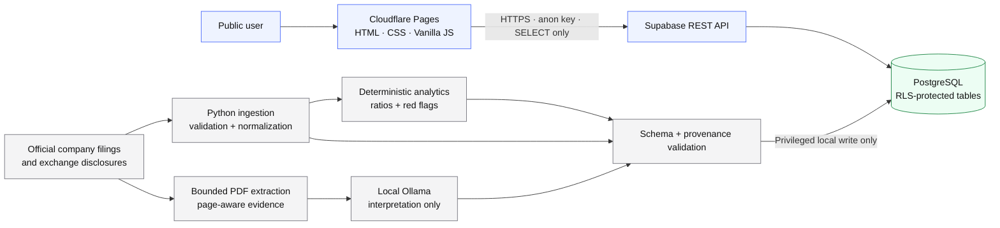

# Architecture

Analyst OS deliberately separates the public read path from the privileged analytical pipeline. Heavy work is precomputed locally; the deployed browser receives only prepared analytical data intended for public display.

## System diagram



## Public path

```text
Browser
  -> Cloudflare Pages
  -> static HTML/CSS/JavaScript
  -> Supabase REST API using browser-safe anon credentials
  -> PostgreSQL tables/views protected by RLS
```

The browser has no production INSERT/UPDATE/DELETE capability. External source links are accepted only when they resolve to HTTPS, and rendered AI text is treated as plain data rather than executable HTML.

## Offline analytical path

```text
Official company / exchange disclosure
  -> bounded document download or controlled local input
  -> file/path/size/signature validation
  -> text/table extraction
  -> normalized financial records + provenance
  -> deterministic Python analytics
  -> deterministic red-flag rules
  -> local Ollama interpretation of verified context
  -> schema validation + provenance validation
  -> privileged local write to Supabase
```

## Trust boundaries

### Untrusted

- Browser input
- External URLs
- Public company documents
- Extracted document text
- AI model output

### Trusted only after validation

- Normalized financial records
- Deterministic calculated metrics
- AI insights matching the application schema and approved evidence policy

### Privileged

- Supabase service-role credentials
- Database write operations
- Local ingestion configuration

Privileged data never crosses into static frontend files. Ollama is bound to loopback-only access and is never part of the public request path.

## Availability model

The public application serves precomputed analytical data. Ollama is offline/local and is not part of request-time serving. This keeps the deployed app lightweight, zero-cost at the intended V1 scale, and independent of a continuously running AI server.

## Design constraints

- Static-first frontend
- Minimal dependencies
- No microservices
- No paid infrastructure required for V1
- Precompute heavy work
- Bound browser queries and timeouts
- Cache prepared analytical results where appropriate
- Add indexes only for measured or obvious query patterns
